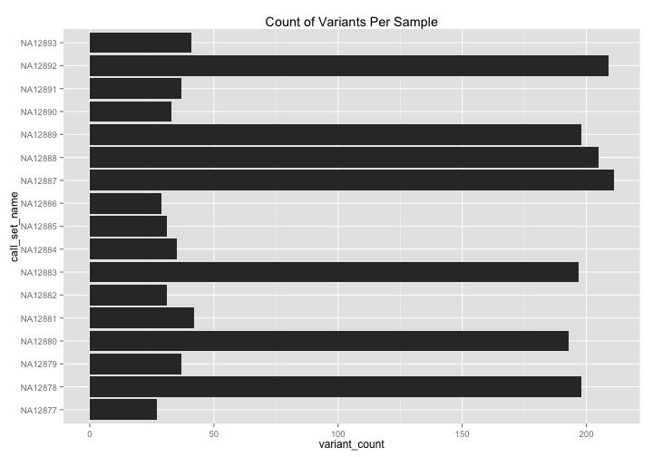

<!-- R Markdown Documentation, DO NOT EDIT THE PLAIN MARKDOWN VERSION OF THIS FILE -->

<!-- Copyright 2014 Google Inc. All rights reserved. -->

<!-- Licensed under the Apache License, Version 2.0 (the "License"); -->
<!-- you may not use this file except in compliance with the License. -->
<!-- You may obtain a copy of the License at -->

<!--     http://www.apache.org/licenses/LICENSE-2.0 -->

<!-- Unless required by applicable law or agreed to in writing, software -->
<!-- distributed under the License is distributed on an "AS IS" BASIS, -->
<!-- WITHOUT WARRANTIES OR CONDITIONS OF ANY KIND, either express or implied. -->
<!-- See the License for the specific language governing permissions and -->
<!-- limitations under the License. -->

# Literate Programming with R and BigQuery

## R Markdown Introduction

This is an [R Markdown](http://rmarkdown.rstudio.com/) document.  By using RMarkdown, we can write R code in a [literate programming](http://en.wikipedia.org/wiki/Literate_programming) style interleaving snippets of code within narrative content.  This document can be read, but it can also be executed.  Most importantly though, it can be rendered so that the results of an R analysis at a point in time are captured.

It is written in [Markdown](http://daringfireball.net/projects/markdown/syntax), a simple formatting syntax for authoring web pages.  See the [`rmarkdown` package](http://cran.r-project.org/web/packages/rmarkdown/index.html) for more detail about how to use RMarkdown from R.  [RStudio](http://www.rstudio.com/) has support for [R Markdown](http://rmarkdown.rstudio.com/) from its user interface.

Now let's proceed with a specific example of [literate programming](http://en.wikipedia.org/wiki/Literate_programming) for [BigQuery](https://cloud.google.com/bigquery/).

## Setup

If you have not used the [bigrquery](https://github.com/hadley/bigrquery) package previously, you will likely need to do something like the following to get it installed:


```r
### To install the bigrquery package
install.packages("bigrquery")
```

Next we will load our needed packages into our session:

```r
require(bigrquery)
require(ggplot2)
require(xtable)
```

And set a few variables:

```r
######################[ CHANGE ME ]##################################
# Set the Google Cloud Platform project id under which these queries will run.
project <- "YOUR-PROJECT-ID"
#####################################################################
```


```r
# By default this codelab runs upon the Illumina Platinum Genomes Variants.
# Change the table here if you wish to run these queries against a different table.
theTable <- "genomics-public-data:platinum_genomes.variants"
```


And write a little convenience function:

```r
DisplayAndDispatchQuery <- function(queryUri) {
  # Read in the SQL from a file or URL.
  querySql <- readChar(queryUri, nchars=1e6)
  # Find and replace the table name placeholder with our table name.
  querySql <- sub("_THE_TABLE_", theTable, querySql, fixed=TRUE)
  # Display the updated SQL.
  cat(querySql)
  # Dispatch the query to BigQuery for execution.
  query_exec(querySql, project)
}
```

## Running a Query in R

Now we're ready to execute our query, bringing the results down to our R session for further examination:

```r
result <- DisplayAndDispatchQuery("../sql/sample-variant-counts-for-brca1.sql")
```

```
# Sample variant counts within BRCA1.
SELECT
  call_set_name,
  COUNT(call_set_name) AS variant_count,
FROM (
  SELECT
    reference_name,
    start,
    END,
    reference_bases,
    GROUP_CONCAT(alternate_bases) WITHIN RECORD AS alternate_bases,
    call.call_set_name AS call_set_name,
    NTH(1,
      call.genotype) WITHIN call AS first_allele,
    NTH(2,
      call.genotype) WITHIN call AS second_allele,
  FROM
      [genomics-public-data:platinum_genomes.variants]
  WHERE
    reference_name = 'chr17'
    AND start BETWEEN 41196311
    AND 41277499
  HAVING
    first_allele > 0
    OR second_allele > 0
    )
GROUP BY
  call_set_name
ORDER BY
  call_set_name
```

Let us examine our query result:

```r
head(result)
```

```
  call_set_name variant_count
1       NA12877            27
2       NA12878           198
3       NA12879            37
4       NA12880           193
5       NA12881            42
6       NA12882            31
```

```r
summary(result)
```

```
 call_set_name      variant_count  
 Length:17          Min.   : 27.0  
 Class :character   1st Qu.: 33.0  
 Mode  :character   Median : 41.0  
                    Mean   :103.2  
                    3rd Qu.:198.0  
                    Max.   :211.0  
```

```r
str(result)
```

```
'data.frame':	17 obs. of  2 variables:
 $ call_set_name: chr  "NA12877" "NA12878" "NA12879" "NA12880" ...
 $ variant_count: int  27 198 37 193 42 31 197 35 31 29 ...
```
We can see that what we get back from bigrquery is an R dataframe holding our query results.

## Data Visualization of Query Results

Now that our results are in a dataframe, we can easily apply data visualization to our results:

```r
ggplot(result, aes(x=call_set_name, y=variant_count)) +
  geom_bar(stat="identity") + coord_flip() +
  ggtitle("Count of Variants Per Sample")
```



Its clear to see that number of variants within BRCA1 for each sample corresponds roughly to two levels.

We can then examine the variant level data more closely:

```r
result <- DisplayAndDispatchQuery("../sql/variant-level-data-for-brca1.sql")
```

```
# Retrieve variant-level information for BRCA1 variants.
SELECT
  reference_name,
  start,
  end,
  reference_bases,
  GROUP_CONCAT(alternate_bases) WITHIN RECORD AS alternate_bases,
  quality,
  GROUP_CONCAT(filter) WITHIN RECORD AS filter,
  GROUP_CONCAT(names) WITHIN RECORD AS names,
  COUNT(call.call_set_name) WITHIN RECORD AS num_samples,
FROM
  [genomics-public-data:platinum_genomes.variants]
WHERE
  reference_name = 'chr17'
  AND start BETWEEN 41196311
  AND 41277499
OMIT RECORD IF EVERY(alternate_bases IS NULL)
ORDER BY
  start,
  alternate_bases
```
Number of rows returned by this query: 335.

Displaying the first few rows of the dataframe of results:
<!-- html table generated in R 3.2.0 by xtable 1.7-4 package -->
<!-- Thu Jul  9 01:02:39 2015 -->
<table border=1>
<tr> <th> reference_name </th> <th> start </th> <th> end </th> <th> reference_bases </th> <th> alternate_bases </th> <th> quality </th> <th> filter </th> <th> names </th> <th> num_samples </th>  </tr>
  <tr> <td> chr17 </td> <td align="right"> 41196407 </td> <td align="right"> 41196408 </td> <td> G </td> <td> A </td> <td align="right"> 733.47 </td> <td> PASS </td> <td>  </td> <td align="right">   7 </td> </tr>
  <tr> <td> chr17 </td> <td align="right"> 41196820 </td> <td align="right"> 41196822 </td> <td> CT </td> <td> C </td> <td align="right"> 63.74 </td> <td> LowQD </td> <td>  </td> <td align="right">   1 </td> </tr>
  <tr> <td> chr17 </td> <td align="right"> 41196820 </td> <td align="right"> 41196823 </td> <td> CTT </td> <td> C,CT </td> <td align="right"> 314.59 </td> <td> PASS </td> <td>  </td> <td align="right">   3 </td> </tr>
  <tr> <td> chr17 </td> <td align="right"> 41196840 </td> <td align="right"> 41196841 </td> <td> G </td> <td> T </td> <td align="right"> 85.68 </td> <td> TruthSensitivityTranche99.90to100.00,LowQD </td> <td>  </td> <td align="right">   2 </td> </tr>
  <tr> <td> chr17 </td> <td align="right"> 41197273 </td> <td align="right"> 41197274 </td> <td> C </td> <td> A </td> <td align="right"> 1011.08 </td> <td> PASS </td> <td>  </td> <td align="right">   7 </td> </tr>
  <tr> <td> chr17 </td> <td align="right"> 41197938 </td> <td align="right"> 41197939 </td> <td> A </td> <td> AT </td> <td align="right"> 86.95 </td> <td> LowQD </td> <td>  </td> <td align="right">   3 </td> </tr>
   </table>


And also work with the sample level data: 

```r
result <- DisplayAndDispatchQuery("../sql/sample-level-data-for-brca1.sql")
```

```
# Retrieve sample-level information for BRCA1 variants.
SELECT
  reference_name,
  start,
  end,
  reference_bases,
  GROUP_CONCAT(alternate_bases) WITHIN RECORD AS alternate_bases,
  call.call_set_name,
  GROUP_CONCAT(STRING(call.genotype)) WITHIN call AS genotype,
  call.phaseset,
  call.genotype_likelihood,
FROM
  [genomics-public-data:platinum_genomes.variants]
WHERE
  reference_name = 'chr17'
  AND start BETWEEN 41196311
  AND 41277499
HAVING
  alternate_bases IS NOT NULL
ORDER BY
  start,
  alternate_bases,
  call.call_set_name
```
Number of rows returned by this query: 1777.


Displaying the first few rows of the dataframe of results:
<!-- html table generated in R 3.2.0 by xtable 1.7-4 package -->
<!-- Thu Jul  9 01:02:41 2015 -->
<table border=1>
<tr> <th> reference_name </th> <th> start </th> <th> end </th> <th> reference_bases </th> <th> alternate_bases </th> <th> call_call_set_name </th> <th> genotype </th> <th> call_phaseset </th> <th> call_genotype_likelihood </th>  </tr>
  <tr> <td> chr17 </td> <td align="right"> 41196407 </td> <td align="right"> 41196408 </td> <td> G </td> <td> A </td> <td> NA12878 </td> <td> 0,1 </td> <td>  </td> <td align="right">  </td> </tr>
  <tr> <td> chr17 </td> <td align="right"> 41196407 </td> <td align="right"> 41196408 </td> <td> G </td> <td> A </td> <td> NA12880 </td> <td> 0,1 </td> <td>  </td> <td align="right">  </td> </tr>
  <tr> <td> chr17 </td> <td align="right"> 41196407 </td> <td align="right"> 41196408 </td> <td> G </td> <td> A </td> <td> NA12883 </td> <td> 0,1 </td> <td>  </td> <td align="right">  </td> </tr>
  <tr> <td> chr17 </td> <td align="right"> 41196407 </td> <td align="right"> 41196408 </td> <td> G </td> <td> A </td> <td> NA12887 </td> <td> 0,1 </td> <td>  </td> <td align="right">  </td> </tr>
  <tr> <td> chr17 </td> <td align="right"> 41196407 </td> <td align="right"> 41196408 </td> <td> G </td> <td> A </td> <td> NA12888 </td> <td> 0,1 </td> <td>  </td> <td align="right">  </td> </tr>
  <tr> <td> chr17 </td> <td align="right"> 41196407 </td> <td align="right"> 41196408 </td> <td> G </td> <td> A </td> <td> NA12889 </td> <td> 0,1 </td> <td>  </td> <td align="right">  </td> </tr>
   </table>

## Provenance

Lastly, let us capture version information about R and loaded packages for the sake of provenance.

```r
sessionInfo()
```

```
R version 3.2.0 (2015-04-16)
Platform: x86_64-apple-darwin13.4.0 (64-bit)
Running under: OS X 10.10.3 (Yosemite)

locale:
[1] en_US.UTF-8/en_US.UTF-8/en_US.UTF-8/C/en_US.UTF-8/en_US.UTF-8

attached base packages:
[1] stats4    parallel  stats     graphics  grDevices utils     datasets 
[8] methods   base     

other attached packages:
 [1] xtable_1.7-4             ggplot2_1.0.1           
 [3] bigrquery_0.1.0          knitr_1.10.5            
 [5] Bioc2015Workshop_0.1     VariantAnnotation_1.14.1
 [7] GenomicAlignments_1.4.1  Rsamtools_1.20.4        
 [9] Biostrings_2.36.1        XVector_0.8.0           
[11] GenomicRanges_1.20.4     GenomeInfoDb_1.4.0      
[13] IRanges_2.2.2            S4Vectors_0.6.0         
[15] BiocGenerics_0.14.0      devtools_1.8.0          

loaded via a namespace (and not attached):
 [1] reshape2_1.4.1         colorspace_1.2-6       testthat_0.10.0       
 [4] htmltools_0.2.6        yaml_2.1.13            rtracklayer_1.28.4    
 [7] GenomicFeatures_1.20.1 XML_3.98-1.2           DBI_0.3.1             
[10] BiocParallel_1.2.2     lambda.r_1.1.7         plyr_1.8.2            
[13] stringr_1.0.0          zlibbioc_1.14.0        munsell_0.4.2         
[16] gtable_0.1.2           futile.logger_1.4.1    evaluate_0.7          
[19] memoise_0.2.1          labeling_0.3           Biobase_2.28.0        
[22] biomaRt_2.24.0         curl_0.9.1             AnnotationDbi_1.30.1  
[25] highr_0.5              proto_0.3-10           Rcpp_0.11.6           
[28] scales_0.2.4           BSgenome_1.36.0        formatR_1.2           
[31] rversions_1.0.1        jsonlite_0.9.16        digest_0.6.8          
[34] stringi_0.5-5          dplyr_0.4.1            grid_3.2.0            
[37] tools_3.2.0            bitops_1.0-6           magrittr_1.5          
[40] RCurl_1.95-4.6         RSQLite_1.0.0          futile.options_1.0.0  
[43] crayon_1.3.0           MASS_7.3-40            xml2_0.1.1            
[46] assertthat_0.1         rmarkdown_0.6.1        httr_1.0.0            
[49] rstudioapi_0.3.1       R6_2.1.0               git2r_0.10.1          
```
